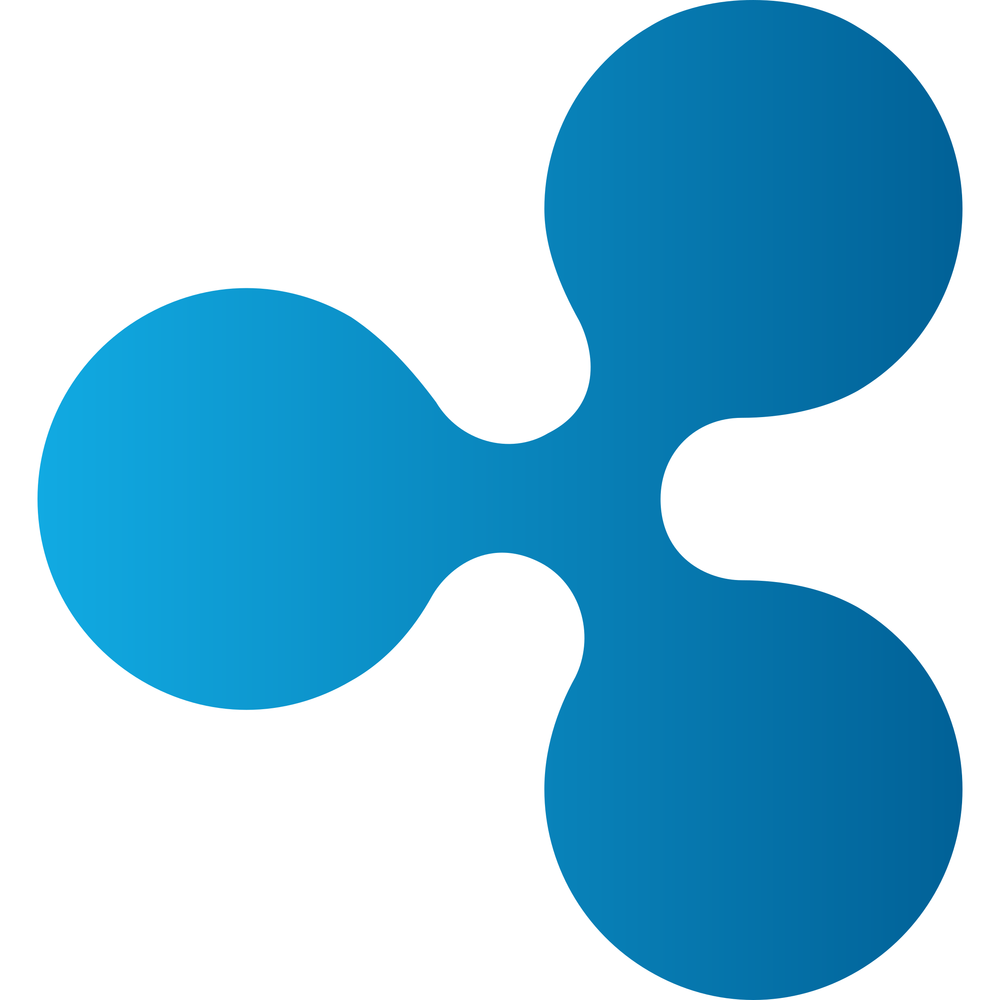
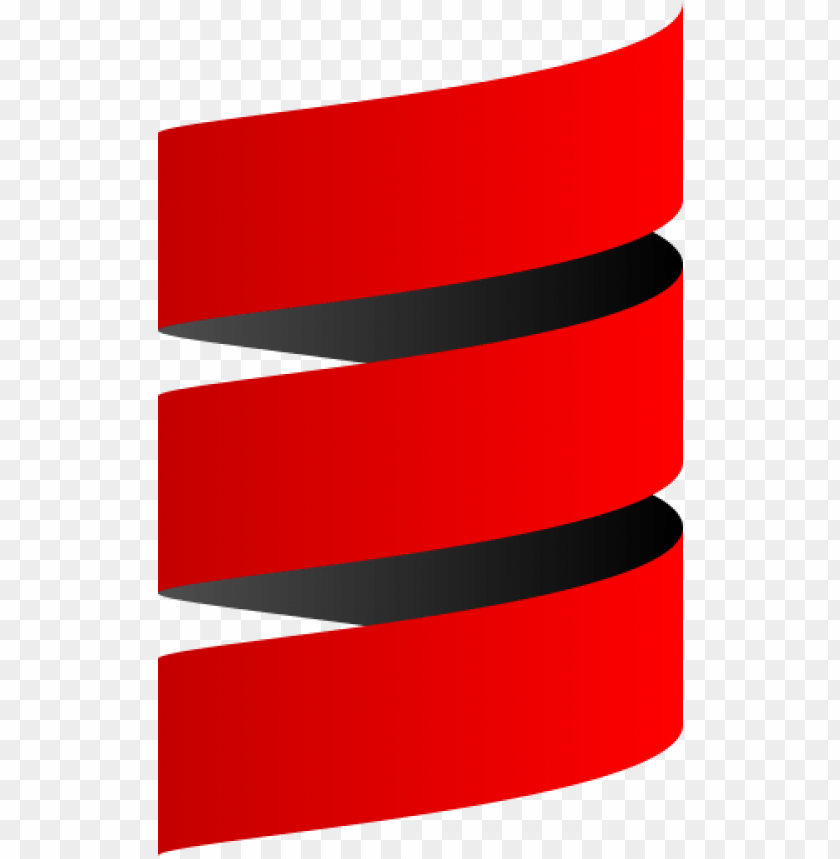
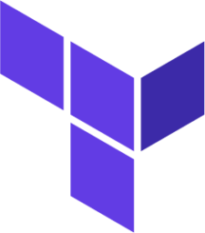

## Hi there 👋

<!--
**johngodoi/johngodoi** is a ✨ _special_ ✨ repository because its `README.md` (this file) appears on your GitHub profile.

Here are some ideas to get you started:

- 🔭 I’m currently working on ...
- 🌱 I’m currently learning ...
- 👯 I’m looking to collaborate on ...
- 🤔 I’m looking for help with ...
- 💬 Ask me about ...
- 📫 How to reach me: ...
- 😄 Pronouns: ...
- ⚡ Fun fact: ...
-->
# Hi there 👋

**I'm John Godoi, a software engineer with more than 13 years of experience. Most of this time, I have worked with Web2 development and data engineering. However, for the last 2 years, I have changed my focus to the exciting world of crypto, blockchain, and Web3. I like to learn more and more about it, and I'm getting a passion for what the future of finance will look like.**

 
 

 

 

**A bit about me:**

<!-- * **Passionate about:** [Your Interests, e.g., software development, data science, machine learning] -->
* **Skills:** 
  * **Languages**: TypeScript, Nodejs, Javascript, Go, Python, Scala, Java, Solidity
  * **Blockchains**: Distributed Ledger Technology, Bitcoin, Ethereum, Tron, Ripple, Gnosis
  * **Tokenization**: Smart-contracts, Stablecoins (ERC-20), NFTs (ERC-721), Structured Multi-tokens (ERC-1155)
  * **Backend**: API Rest, Microservices, Object-Oriented Programming, Functional Programming, Test-Driven Development
  * **Web3**: web3.js, ethers.js, Metamask, Fireblocks, Custody, Etherscan, Tronscan, xrp explorer
  * **Architectures**: Domain Driven Design, Event Driven Architecture, Clean Architecture, Vertical Slicing
  * **AWS**: Lambda, ECS, ECR, Fargate, EC2 Nitro Enclave, Step-functions, Event-Bridge, SQS, SNS, API Gateway, ELB, ALB, AppSync, DynamoDB, RDS, ElastiCache, Glue (Job, Catalog and Crawler), Athena, S3, EMR, RedShift, Secrets Manager, Parameter Store, KMS, IAM, Cloudwatch, x-Ray
  * **Testing**: Pytest, Scalatest, mocha, Jest, behave, JUnit, Selenium, pyramidal testing: acceptance, integration (straight and e2e), unit tests and mocks
  * **DevOps**: Docker, Kubernetes, terraform, cloudformation, sam, codepipeline, codebuild, codedeploy, codeartifact, codecommit, git, github
  * **Data Engineering**: Datamesh, Datalake, Datawarehouse, ETL, Star Schema and Snow-flake modeling, tiered-layer architecture, data pipelines, SQL, NoSQL
  * **Soft Skills**: Teamwork, Adaptability, Critical Thinking, Attention to Detail, Cross-Cultural Communication Skills, Problem-Solving
<!-- * **Currently working on:** [Your Current Projects] -->>

**Connect with me:**

* **LinkedIn:** [johngodoi](https://linkedin.com/in/johngodoi)
* **ENS:** [johngodoi.eth](johngodoi.eth)
* **Basename:** [johngodoi](johngodoi.base.eth)

**Let's build something great together!**
